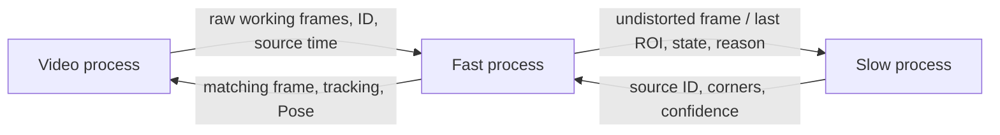

# Three-process runtime

## Run

From the project root with the virtual environment active:

```powershell
python main.py --video videos/landing_pad_test.mp4
python main.py --video videos/landing_pad_test.mp4 --headless --output outputs/runtime
python main.py --camera 0 --camera-params calibration/camera_params.npz
python main.py --help
```

The camera/video must match the stored calibration's original dimensions, lens,
zoom and crop. A camera with different settings needs matching calibration.
Calibration is loaded at startup, not recalculated during operation. Q in the
display window and Ctrl+C request shutdown. `--max-frames N` limits input length.
GUI display was not exercised in automated validation; headless output and overlay
rendering were checked.

## Responsibilities



`main.py` is a supervisor that starts three worker processes with the `spawn`
context, monitors errors and joins workers. It performs no CV processing. This
is three application workers plus their launching parent, not three threads.

- **Video:** decodes the source, attempts source-rate playback, resizes for bounded
  transfer cost, sends frames only to Fast, and displays/saves annotated results.
- **Fast:** undistorts once, performs LK/H tracking and A4 Pose, detects loss,
  schedules Slow requests, aligns delayed results, and records metrics.
- **Slow:** performs contour/X detection and calibrated candidate validation.
  It receives frames only through Fast. The periodic interval defaults to one
  second of source time, with local retries every 0.2 seconds after recent loss.
  Periodic corrections also run while tracking, rather than detecting every frame.

All vision components remain classical OpenCV. OpenCV uses one thread per worker
to avoid each process creating its own large compute pool.

## Coordinates and confidence

The default working width is 1280; no upscaling is applied. Video verifies the
original input size before resizing. The two rows of K are scaled by the actual
horizontal/vertical resize ratios. Fast uses that K to undistort and keeps the
same K for Pose. Slow receives already-undistorted images and must not apply
distortion again. Both workers use the original 5 px error gate scaled to the
working image (1.6667 px for 3840 -> 1280). The logs explicitly state the working
size, K, coordinate space and Pose threshold. There is no ROI-origin ambiguity:
local detector results are translated back into full working-frame coordinates.

`valid` means tracking is valid; `pose_valid` separately gates metric output.
Distance and XYZ are metres, RPY in JSON is radians, and the display shows degrees.
Distance is norm(XYZ), not height; yaw has a 180-degree X-marker ambiguity.
The display's Valid/Invalid status refers to available Pose. Tracking confidence
is the homography inlier ratio; after reinitialization it is the detector's X
score. These are heuristic scores, not calibrated probabilities.

## Queues, delayed results and overload

Each of the four image/request/result queues has capacity one. Frame and display
messages use best-effort replacement to avoid backlog; a multiprocessing feeder
race may drop an incoming frame as well. Requests, replies and EOF sentinels use
timed reliable puts that observe the shared stop event. `Queue.empty()`/`qsize()`
are not used for synchronization, and exceptions are not swallowed indiscriminately.
Only one detection request is outstanding at a time.

Fast retains at most 16 received undistorted frames. On a reply it:

1. Checks the outstanding request ID and source timestamp.
2. Rejects a result whose source frame expired from history.
3. Initializes a temporary tracker on that exact source frame.
4. Replays each subsequent received frame to the current frame.
5. Requires successful tracking and a passing current-frame Pose before installing
   the temporary tracker. A failed correction does not overwrite a healthy track.

The default maximum gap is five source frame indices; larger input/replay gaps
cause loss/rejection. This protects against blindly jumping over large motion.
Catch-up consumes Fast CPU and can itself cause input drops; history is bounded
to limit that cost. The runtime trades coverage for bounded image backlog.

Three consecutive bad tracked poses trigger loss, as in the Day 2 fix. The normal
slow scheduler then handles recovery. Image histories are bounded, while compact
per-frame metrics are retained until shutdown and grow with recording length.

Each display result contains its own undistorted frame. The Video process never
draws old corners on a newer raw frame. It displays the latest processed image,
which can lag the source, with its frame ID and measured result latency.

## End of stream and errors

Normal EOF flows Video -> Fast -> Slow, with Fast -> Video signalling completion.
Fast allows an outstanding final detection to finish (bounded timeout), replays
it only over existing history, and may revise the last frame's result. JSON holds
one final record per processed ID. Control sentinels are not dropped as image data.

Q, Ctrl+C or a worker exception set a shared event. Queue operations use timeouts,
workers release capture/UI resources, and producer feeder threads are cancelled
only on interruption where pending data may be discarded. The supervisor uses
bounded joins and termination only as fallback, records exit codes/errors, and
returns failure for worker errors. `runtime_summary.json` records worker PIDs,
exit status and any forced termination. Normal EOF and error/cancellation tests
completed without forced termination.

## Outputs and measured behaviour

- `results.json`: one record per processed source frame, separate tracking/Pose
  validity, geometry, latency, and slow-response acceptance/rejection events.
- `metrics.csv`: numeric performance/quality values for plotting.
- `frame_*.jpg`: sampled overlays, not an encoded output video.
- `runtime_summary.json`: launch configuration, PIDs, exits and worker summaries.
- `graphs/`: automatically generated timing, reprojection and Pose-availability
  graphs plus a combined overview (PNG/SVG), statistics and Hebrew explanations.

`main.py` exports the graphs in the parent only after all workers exit and Fast
confirms saving the current run. The plot threshold comes from `results.json`.
Graceful early stops also export when at least two frames were saved. Short,
failed or incomplete runs explicitly skip export; status is recorded in the
runtime summary. A plotting failure is reported separately and preserves raw data.
To regenerate the same graphs later:

```powershell
python -m metrics.export_report_figures --run outputs/runtime
```

The graph shows Fast processing time, frame-to-result latency, reprojection RMS
and Pose availability over source time. Latency begins after decode/playback
scheduling, before resize/IPC; it excludes decoder delay, display and accumulated
source playback lag. Effective throughput must therefore also be measured using
total elapsed wall time, not inferred from the Fast-processing median alone.

One full headless run on `landing_pad_test.mp4` decoded 1,006 frames, processed
988, and returned 608 accepted poses. Eighteen source frames had no Fast result.
Elapsed Video time was 46.09 s for approximately 33.5 s of source video, giving
about 21.5 processed FPS rather than a sustained 30 FPS. IPC, decoding, scheduling
and replay all contribute; no isolated bottleneck claim has been established.
Three distinct worker PIDs were observed and all exited with code zero.

The previously reviewed absence spans 380–450 and 720–755 had no tracking/Pose
outputs on the frames processed in this run. This is not exhaustive false-positive
validation. Runtime counts must not be directly ranked against the consecutive
4K Day 2 run: asynchronous scheduling, dropped frames and working resolution
change the conditions. Repeated runtime counts may vary with machine load.

Artifacts: `outputs/runtime_new_video/`, including `performance.png` and
`validation.json`. The synthetic asynchronous run was also compared against
known positions and checked for absent metric output while the target was absent.

## Verification and remaining work

Eight runtime tests passed, including actual spawn processes, delayed moving-target
correction, expired/wrong result IDs, disappearance during catch-up, failed periodic
correction, EOF with a request in flight, worker error propagation, and shared-event
cancellation. Fourteen existing tracking and twelve Pose tests also passed.

```powershell
python -m unittest discover -s tests -p test_runtime.py
```

The architecture is implemented and tested; sustained source-rate performance is
not yet established. Remaining submission work includes performance profiling,
six distinct video scenarios and their analysis, and physical distance validation.
The current real video has already been used for development, so a further unseen
recording is needed for independent validation of the completed pipeline.
