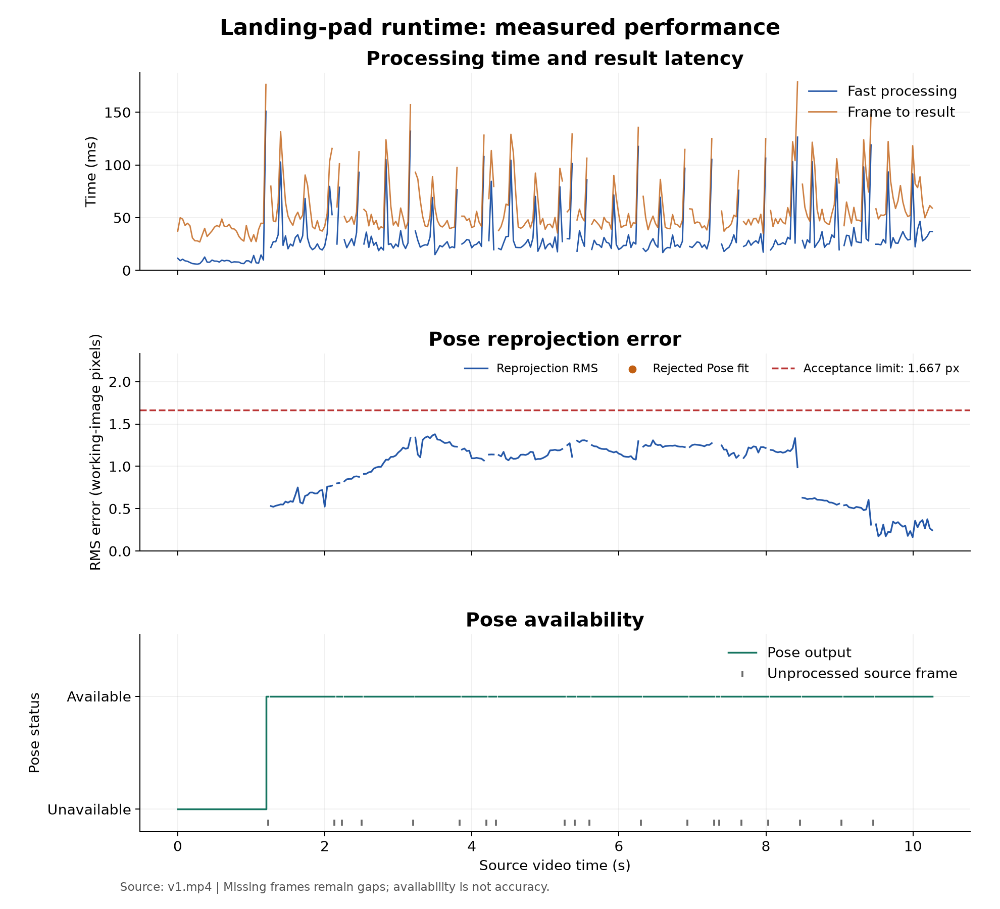
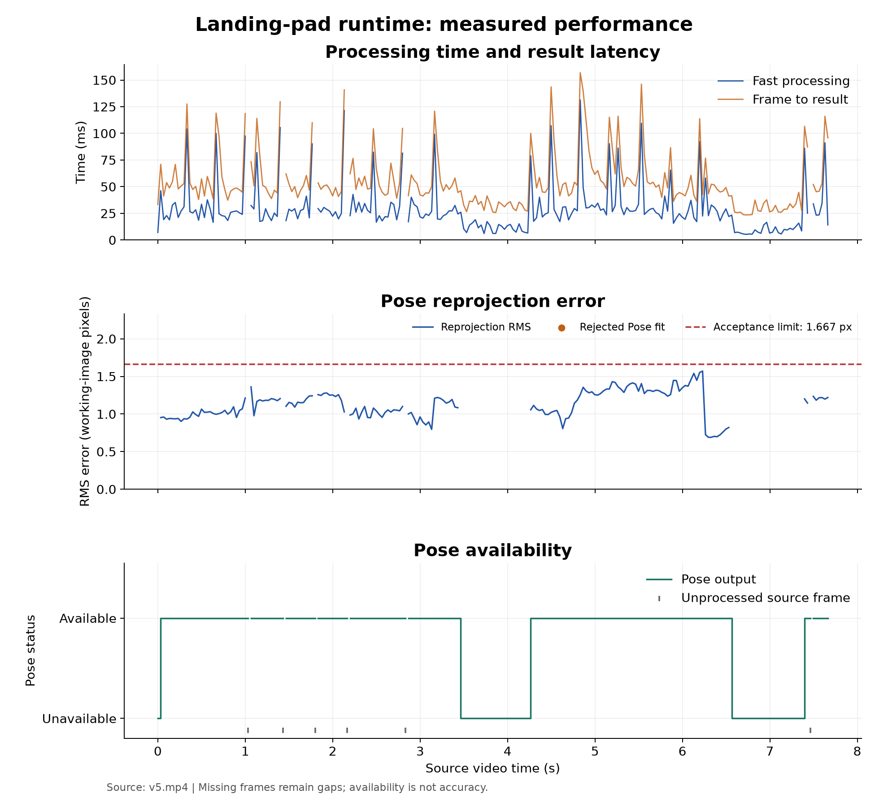
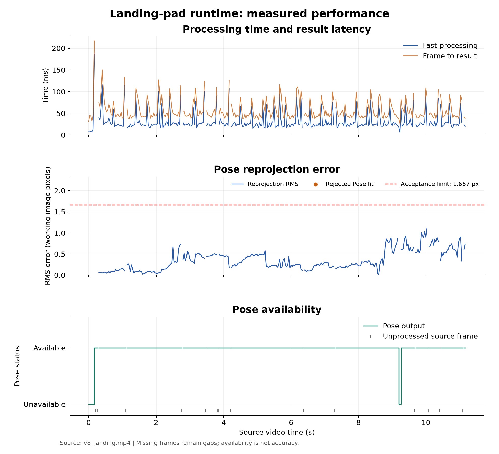

# מערכת לזיהוי משטח נחיתה ומעקב אחריו

מסמך טכני להגשת תרגיל הבית | ספטמבר 2026

המערכת מזהה דף A4 מלבני עם X שחור, עוקבת אחר ארבע פינותיו ומחשבת את מיקום מרכז הדף ותנוחתו ביחס למצלמה. המימוש מבוסס על ראייה ממוחשבת קלאסית ב-OpenCV וכולל יישום כיול נפרד ושלושה תהליכי עבודה מקביליים. מסמך זה מרכז את התכנון, האלגוריתמים, אופן ההרצה ותוצאות שמונת ניסויי הווידאו.

**המימוש פועל מקצה לקצה ונבדק על שמונה סרטונים.** הריצה החדשה של v1 הושלמה עד סוף הקובץ ונכללת בכל המספרים במסמך. קיימות מגבלות מתועדות: כשל ללא התאוששות בסוף v5, איבודים זמניים ב-v6 וב-v8, קצב עיבוד כולל הנמוך מקצב המקור, והיעדר אימות מרחק פיזי. Pose שעבר בדיקות פנימיות אינו שקול למדידה שאומתה מול אמת חיצונית.

## 1 התאמה לדרישות התרגיל

| דרישה | המימוש והראיה |
| --- | --- |
| ראייה ממוחשבת קלאסית | ספים, קונטורים, Hough, Harris, Lucas-Kanade, RANSAC ו-PnP; ללא מודל למידה. |
| כיול נפרד | `calibration/calibrate.py` ושמירת K ועיוותים בקובץ פרמטרים. |
| שלושה תהליכים | Video קורא ומציג, Fast עוקב ומחשב Pose, Slow מבצע זיהוי מחדש. התהליך הראשי מפקח עליהם. |
| זיהוי איבוד והתאוששות | בדיקות גיאומטריה, נקודות ואימות X, בקשות זיהוי ועיבוד תוצאות מאוחרות. |
| מיקום ותנוחה | XYZ, מרחק למרכז הדף ו-Roll Pitch Yaw, עם בדיקת שגיאת הקרנה. |
| לפחות שישה ניסויי וידאו | שמונה סרטוני מקור עם תיאור מטרת הבדיקה, הצלחות ומגבלות. |
| מדד גרפי לאורך זמן | זמן עיבוד והשהיה, שגיאת הקרנה וזמינות Pose; נוצרים אוטומטית בסיום main. |
| תיעוד והרצה | המסמך הנוכחי, קובץ requirements והוראות ההרצה בהמשך. |

סרטוני הניסוי מתעדים צילום ידני בטלפון, ולא ניסוי טיסה או מערכת בקרת נחיתה. המערכת מציגה תוצאות ושומרת דגימות תמונה; היא אינה מקודדת אוטומטית סרטון פלט עם שכבת הסימון.

## 2 ארכיטקטורת המערכת

התהליך הראשי טוען את ההגדרות ואת פרמטרי המצלמה, יוצר תורים ואירוע עצירה משותף ומפעיל שלושה תהליכים באמצעות spawn. כך המימוש מתאים גם ל-Windows. פענוח הווידאו, המעקב והזיהוי המלא מופרדים, כדי שפעולת הזיהוי היקרה לא תחסום כל עדכון מעקב.

```text
main  ->  starts and supervises Video, Fast, Slow

Video -- frames --> Fast -- detection requests --> Slow
Video <-- frame + result -- Fast <-- detections -- Slow

Shared stop event + bounded queues + frame IDs + timestamps
```

| רכיב | אחריות | קבצים מרכזיים |
| --- | --- | --- |
| Video | קריאה, שינוי גודל, משלוח ל-Fast, הצגת תוצאה על הפריים התואם ושמירת דגימות. | `processes/video_player.py` |
| Fast | תיקון עיוות, מעקב, Pose, בדיקות איכות, היסטוריה ותיאום זיהוי מחדש. | `processes/fast_process.py` ו-`runtime_engine.py` |
| Slow | איתור מרובעים, אימות X ובחירת מועמד אמין. | `processes/slow_process.py` ו-`detection/` |
| מפקח | הפעלת התהליכים, טיפול בסיום ובתקלות ויצירת גרפים. | `main.py` ו-`processes/supervision.py` |

## 3 כיול המצלמה ומרחב הקואורדינטות

הכיול בוצע עבור מצלמת Samsung S25 Ultra באמצעות צילומי לוח שחמט. מאחר שלא היה לוח מודפס או סרגל, נעשה שימוש בלוח על מסך וביחידת משבצת שרירותית. הקוד מאתר פינות פנימיות, משפר את מיקומן באמצעות cornerSubPix ומחשב מטריצת מצלמה ועיוותי עדשה באמצעות calibrateCamera. המדידה המטרית של משטח הנחיתה מתקבלת בהמשך ממידות A4 הידועות.

הכיול שנשמר משתמש ב-45 תמונות ברזולוציה 3840 על 2160 פיקסלים. שגיאת RMS הכוללת היא 0.5107 פיקסלים. שתי תמונות חריגות הוחרגו במפורש, ונבחר מודל עם מקדם רדיאלי אחד בנוסף למקדמים המשיקיים. זהו מדד התאמה לתמונות הכיול; הוא אינו מדידת דיוק מרחק בעולם.

```text
K = [[3351.0112,    0.0000, 1869.4475],
     [   0.0000, 3350.8104, 1062.0894],
     [   0.0000,    0.0000,    1.0000]]

dist = [0.00558116, 0, 0.00166020, -0.00056361, 0]
# order: k1, k2, p1, p2, k3
```

בריצות המתועדות התמונה הוקטנה ל-1280 על 720. בהתאם, ערכי המוקד והנקודה הראשית ב-K חולקו בשלוש. Fast מתקן את עיוות העדשה, ולאחר מכן גם המעקב וגם חישוב ה-Pose משתמשים בקואורדינטות התמונה המתוקנת ובאפס עיוות נוסף. הפעלת תיקון העיוות פעם נוספת בחישוב Pose תהיה שגויה.

סף שגיאת ההקרנה הוא 5 פיקסלים ברזולוציה המקורית, שהם 1.6667 פיקסלים ברזולוציית העבודה הנוכחית. הנתון האחרון הוא הסף המוצג בגרפי הניסויים. צילום חדש צריך להתאים לכיול בעדשה, בזום, בכיוון ובמצב הצילום; התאמה של מספר הפיקסלים לבדה אינה מספיקה. הקוד בודק את מידות הקלט ואינו מסיק אוטומטית כיצד למפות כיול לאחר סיבוב או חיתוך.

## 4 זיהוי המשטח ואימות סימון X

SlowDetector מפיק כמה מסכות משלימות: קצוות Canny, סף Otsu ואזורים בהירים בעלי רוויה נמוכה ב-HSV. פעולות סגירה ופתיחה מורפולוגיות מסייעות לחיבור גבולות ולהסרת חיבורים דקים לרקע. מכל מסכה מופקים קונטורים ומועמדים למרובע קמור. מועמדים קטנים מדי או קרובים מדי לגבול התמונה נפסלים, ומועמדים כפולים מאוחדים.

לצורך מיקום הפינות מותאמים קווים עמידים לחריגים לקטעי הגבול הנצפים, ונקודות החיתוך שלהם נותנות את הפינות. העידון נעשה לפי ראיות בתמונה; אין הזזה מלאכותית של הפינות רק כדי לכפות יחס A4. כל מועמד מיושר באמצעות הומוגרפיה לתצוגה חזיתית, ולאחר מכן נבדק הסימון שבתוכו.

x_detector משתמש בניגודיות ובסף בינארי, בקצוות וב-Hough לאיתור שני אלכסונים. הוא בודק מפגש באזור המרכז, תמיכה לאורך ארבע הזרועות והאם רוב הדיו מוסבר על ידי ה-X. בדיקות אלו דוחות מלבן לבן בלי X, וכן צורות שחורות שאינן מתאימות לסימון. בדיקת המרובע נדרשת בנוסף, כדי שדף מעוגל עם X לא יספיק לזיהוי המשטח.

נבדקים גם המראה הבהיר של שולי הדף והתאמה גיאומטרית למודל A4 באמצעות פרמטרי המצלמה. מועמד עם שגיאת הקרנה גדולה מדי נפסל. ציון איכות הסימון הוא ציון היוריסטי המבוסס על בדיקות אלה, ולא הסתברות מכוילת לכך שהזיהוי נכון.

## 5 מעקב מהיר וזיהוי איבוד

לאחר זיהוי תקין המעקב מתחיל מארבע פינות הדף ומנקודות Harris בתוך המשטח. Lucas-Kanade עוקב אחר הנקודות מפריים לפריים. בדיקה קדימה ואחורה וגבול לשגיאה הפוטומטרית מסננים התאמות בלתי יציבות. RANSAC מתאים הומוגרפיה בין מיקום הנקודות במשטח לבין התמונה הנוכחית ומסנן חריגים.

המערכת דורשת לפחות שש נקודות, ובהן ארבע פינות העוגן, ובודקת תמיכה מרחבית, יחס נקודות שתומכות בהומוגרפיה ועקביות הפינות. המרובע חייב להישאר קמור ובתחום התמונה, עם שינוי שטח ותנועה סבירים. נקודות פנים מתווספות לפי הצורך, ואימות X חוזר נעשה מדי עשרה פריימי מעקב. כך אין הסתמכות בלתי מוגבלת על זיהוי התחלתי יחיד.

כשבדיקה נכשלת, המעקב מאופס ונרשמת סיבת האיבוד. חישוב Pose נבדק בנפרד: ייתכן מעקב תקין ללא Pose שעובר את הסף. לאחר שלוש פסילות Pose רצופות ברירת המחדל מאפסת את המעקב. אין הצגה של מרחק וזוויות ישנים כאילו חושבו מחדש בפריים שנכשל.

## 6 חישוב מיקום ותנוחה

ארבע פינות המודל מוגדרות במטרים על מישור שמרכזו בראשית. צלעות הדף הן 0.210 ו-0.297 מטר, ולכן קואורדינטות הפינות הן כל הצירופים של x שווה פלוס או מינוס 0.105 ושל y שווה פלוס או מינוס 0.1485, כאשר z שווה אפס. פינות התמונה הן נקודות שנמדדו בזיהוי או במעקב; הן אינן ערך ברירת מחדל של 0,0.

הפתרון משתמש ב-solvePnPGeneric עם IPPE למטרה מישורית, ולאחר מכן בעידון איטרטיבי. נבחנות שתי האפשרויות לשיוך הצלע הקצרה. פתרונות שאינם סופיים, שממקמים פינה מאחורי המצלמה או ששגיאת ההקרנה שלהם גדולה מדי נפסלים. מבין פתרונות דומים באיכות ניתן להעדיף רציפות סיבובית ביחס ל-Pose הקודם; לאחר איבוד או פסילה אין שימוש בלתי מבוקר באומדן הקודם.

| פלט | פירוש ויחידות |
| --- | --- |
| XYZ | מיקום מרכז הדף ביחס למצלמה במטרים: x ימינה, y למטה, z קדימה. |
| Distance | הנורמה של וקטור התרגום: מרחק המצלמה ממרכז הדף. אינו בהכרח גובה מעל הרצפה. |
| Roll Pitch Yaw | זוויות במוסכמה R = Rz(yaw) Ry(pitch) Rx(roll). בקובץ התוצאות ברדיאנים ובתצוגה במעלות. |
| Reprojection RMS | שורש ממוצע ריבועי המרחקים בין ארבע הפינות הנמדדות להקרנת פינות המודל, בפיקסלים. |

לסימון X ולמלבן יש סימטריה של 180 מעלות, ולכן אי אפשר להעניק לפינות תוויות פיזיות חד משמעיות מהסימון לבדו. רציפות בזמן מסייעת לבחור ייצוג יציב, אך אינה פותרת את הסימטריה. במבט רחוק או כמעט חזיתי יכולים להופיע פתרונות תנוחה דומים בשגיאת ההקרנה. לפיכך אין לפרש את yaw ככיוון מצפן מוחלט או כזיהוי חד משמעי של כיוון רחפן.

## 7 תקשורת וסנכרון בין התהליכים

לכל הודעת פריים יש מספר מקור וחותמת זמן. קיימים ארבעה תורים מוגבלים לגודל אחד: Video אל Fast, Fast אל Slow, Slow אל Fast ו-Fast אל Video. תורי התמונה והתצוגה מעדיפים מידע עדכני ויכולים להשמיט פריימים בעומס. משלוח בקשות, תשובות ואותות סיום משתמש בהמתנות מוגבלות ובבדיקת אירוע העצירה. יש לכל היותר בקשת זיהוי אחת הממתינה לתשובה.

Fast מחזיק היסטוריה מוגבלת של 16 פריימים שהתקבלו. אם Slow מחזיר זיהוי עבור פריים ישן, המערכת בודקת שהמזהה והזמן תואמים לבקשה ושהפריים עדיין בהיסטוריה. היא מאתחלת עותק זמני של המעקב על אותו פריים, מריצה אותו דרך הפריימים שנשמרו ומאמתת Pose בנקודת הזמן הנוכחית. רק תוצאה שהשלימה את התהליך יכולה להחליף את המעקב הפעיל.

```text
Example: Slow detects frame 100; Fast is now at frame 106
1. Validate the request and locate frame 100 in history
2. Initialize a temporary tracker on frame 100
3. Replay the received frames up to 106
4. Check geometry and Pose on frame 106
5. Install only the validated current result
```

כך פינות מפריים 100 אינן מוצמדות ישירות לתמונה 106. תוצאה שפג תוקפה, תשובה שלילית או כשל בהשלמת המעקב אינם מחליפים מעקב בריא. פער גדול מחמישה מזהי מקור בין פריימים פוסל את רציפות המעקב. שליחת הפריים המתוקן יחד עם התוצאה לתהליך Video מבטיחה שגם התצוגה מצמידה פינות לתמונה הנכונה.

ברירת המחדל מאפשרת זיהוי מלא פעם בשניית מקור, גם במהלך מעקב, וניסיון מקומי לאחר איבוד במרווח של 0.2 שנייה. אלה מרווחי תזמון ולא הבטחה לתדירות ביצוע בפועל. העומס ומשך פעולת Slow משפיעים על זמן קבלת התשובה.

בסוף הקובץ מועברים אותות סיום, מתאפשרת השלמת בקשת Slow ממתינה ונשמרים הפלטים. Q, Ctrl+C או תקלה מפעילים אירוע עצירה משותף. המפקח משתמש בזמני המתנה ובסיום כפוי כמוצא אחרון כדי למנוע תהליך שנותר תקוע. תורי התמונות וההיסטוריה מוגבלים בזיכרון, אך רשימת מדדי הפריימים גדלה עם משך הריצה, ולכן שימוש ממושך מאוד ידרוש כתיבה הדרגתית.

## 8 התקנה והרצה

יש להריץ משורש הפרויקט ב-Windows, עם Python וסביבת העבודה של הפרויקט. הפקודות הבאות מיועדות ל-CMD. ב-PowerShell פקודת ההפעלה של הסביבה היא `.venv\Scripts\Activate.ps1`. אם הסביבה כבר פעילה אין צורך ליצור אותה מחדש.

```text
python -m venv .venv
.venv\Scripts\activate.bat
python -m pip install -r requirements.txt
python main.py --video videos/v1.mp4 --output outputs/experiment_v1
```

תיקיית הפלט נבחרת באמצעות --output. עבור ניסוי חדש יש לבחור שם חדש כדי לשמור את תוצאות הריצה הקודמת. ברירת המחדל טוענת את `calibration/camera_params.npz`. ריצה ללא חלון תצוגה אפשרית עם --headless; משווים ביצועים רק תוך ציון מצב ההרצה, שכן GUI ועומס המחשב משפיעים על המדידה.

```text
python main.py --video videos/v8_landing.mp4 --output outputs/experiment_v8_landing
python main.py --video videos/v1.mp4 --headless --output outputs/v1_headless
python main.py --help
```

לשחזור כיול באמצעות התמונות שכבר חולצו, הפקודה שנבחרה היא:

```text
python calibration/calibrate.py --square-size 1 --radial-order 1 --exclude frame_00660.png frame_00990.png
```

הפקודה מחשבת ושומרת מחדש את פרמטרי המצלמה. אין צורך לבצע אותה בכל ניסוי. גודל משבצת 1 מתאים לכיול הנוכחי ביחידות משבצת; צילום מחדש של לוח אחר מחייב בדיקת מספר הפינות והגדרותיו.

| פלט בתיקיית הניסוי | תוכן |
| --- | --- |
| `results.json` | תוצאות כל הפריימים שעובדו, סיבות פסילה, Pose ואירועי זיהוי. |
| `metrics.csv` | מדידות לאורך זמן לצורך ניתוח וגרפים. |
| `runtime_summary.json` | הגדרות, ספירות פריימים, מזהי תהליכים, קודי יציאה ומצב יצירת הגרפים. |
| `frame_XXXXXX.jpg` | דגימות פלט עם שכבת סימון, לפי מרווח השמירה. |
| `graphs/` | שלושה גרפים נפרדים, סקירה משולבת, PNG ו-SVG, סטטיסטיקה והסברים. |

הגרפים נוצרים אוטומטית בסיום ריצה תקינה או עצירה מסודרת שיש בה לפחות שני פריימים שנשמרו. ריצה שנכשלה או שלא הושלמה אינה מוצגת כאילו הופק עבורה דוח תקין. ליצירה מחדש מנתונים קיימים, בלי להריץ שוב את האלגוריתם:

```text
python -m metrics.export_report_figures --run outputs/experiment_v1
```

## 9 שיטת ההערכה ותוצאות מספריות

המספרים להלן נקראים ישירות מקובצי הריצות השמורים של v1 עד v7 ושל v8_landing. תיאורי התרחישים מבוססים על הסקירה החזותית המדגמית שנעשתה לסרטוני המקור ולדגימות פלט. לצורך הכנת המסמך לא הורץ מחדש האלגוריתם. כל שלושת התהליכים בכל אחת משמונה הריצות סיימו בקוד יציאה 0.

לצד המשטח הוצבו דף A4 לבן ללא X ודף מעוגל עם X. הראשון בודק שמלבן לבן לבדו אינו מספיק; השני בודק שסימון X לבדו אינו מספיק. בדגימות שנבדקו המסגרת הוצמדה לדף המלבני עם X. זו ראיה מדגמית לבחירת המטרה בתנאי הניסוי, ולא מדידת שיעור זיהויי שווא המבוססת על תיוג כל פריים. בתקריבים חלק מהעצמים המסיחים אינם נראים.

| ניסוי | נקראו | עובדו | Pose עבר | זמינות | איבודים | FPS כולל |
| --- | --- | --- | --- | --- | --- | --- |
| v1 | 309 | 289 | 253 | 87.5% | 0 | 16.49 |
| v2 | 199 | 188 | 119 | 63.3% | 0 | 14.39 |
| v3 | 408 | 377 | 373 | 98.9% | 0 | 16.70 |
| v4 | 276 | 265 | 258 | 97.4% | 0 | 18.07 |
| v5 | 231 | 221 | 177 | 80.1% | 2 | 16.78 |
| v6 | 473 | 435 | 352 | 80.9% | 5 | 17.19 |
| v7 | 380 | 351 | 347 | 98.9% | 0 | 17.16 |
| v8_landing | 336 | 323 | 316 | 97.8% | 1 | 18.54 |

זמינות בטבלה היא מספר הפריימים עם Pose שעבר את הבדיקות חלקי מספר הפריימים שעובדו. היא כוללת גם את שלב הרכישה הראשוני. פריימי מקור שלא עובדו אינם נכללים במכנה ואינם מסווגים כאן כזיהוי שגוי. בניסוי v2 המטרה אינה נראית במלואה בתחילת הסרטון, ולכן זמינות נמוכה יותר אינה בהכרח שיעור החמצות גבוה יותר.

בסך הכול נקראו 2,612 פריימים ועובדו 2,449. התקבלו 2,195 אומדני Pose שעברו את הבדיקות, והושמטו 163 פריימי מקור. נספרו 8 איבודי מעקב. אלה ספירות תפעוליות על סרטונים בעלי תנאים שונים, ואין לפרש את היחס המצטבר כדיוק זיהוי מול אמת מתויגת.

הריצה החדשה של v1 משלימה את הריצה הקודמת שנעצרה לאחר 250 פריימי מקור. כעת נקראו כל 309 הפריימים הניתנים לפענוח, עובדו 289, וב-253 התקבל Pose. לאחר הרכישה בפריים 36 לא נרשם איבוד. נתון ה-FPS הכולל בריצה זו הוא 16.49. קובצי הסקירה הישנים נשמרים כראיה היסטורית; המספרים במסמך זה הם העדכניים.

| ניסוי | חציון עיבוד במילישניות | חציון השהיה במילישניות | חציון RMS בפיקסלי עבודה |
| --- | --- | --- | --- |
| v1 | 24.85 | 48.11 | 1.130 |
| v2 | 24.43 | 49.68 | 0.350 |
| v3 | 29.42 | 56.02 | 0.623 |
| v4 | 24.84 | 50.06 | 0.935 |
| v5 | 24.12 | 51.23 | 1.102 |
| v6 | 27.73 | 53.94 | 0.731 |
| v7 | 27.12 | 54.09 | 0.243 |
| v8_landing | 24.78 | 47.97 | 0.287 |

FPS כולל מחושב כמספר הפריימים שעובדו חלקי הזמן הכולל שדווח על ידי Fast. זמני התחלה, המתנה וסיום עשויים להשפיע, בעיקר בסרטונים קצרים. חציון זמן העיבוד מתייחס לפעולה על פריים, וההופכי שלו אינו FPS המערכת. מדד ההשהיה מתחיל לאחר הפענוח ותזמון הקריאה ומסתיים ביצירת התוצאה; הוא אינו כולל את זמן הפענוח, התצוגה או מלוא הפיגור האפשרי ביחס לקצב המקור.

## 10 תיאורי שמונת ניסויי הווידאו

### ניסוי 1 התקרבות הדרגתית למשטח בנוכחות עצמים מסיחים

קובץ מקור: `videos/v1.mp4`. פלט: `outputs/experiment_v1/`.

**מה נבדק:** בדיקת זיהוי ומעקב כאשר מתקרבים אל דף ה-A4 והוא גדל בתמונה. לצד המטרה מופיעים דף לבן ללא סימון, צורה עגולה עם צלב וקופסה, המוסיפים אתגר של בחירת המשטח הנכון.

**מה הצליח:** הריצה החדשה הסתיימה במלואה וקראה 309 פריימי מקור. ה-Pose הראשון התקבל בפריים 36, כ-1.20 שניות מתחילת הסרטון. לאחר מכן כל 253 הפריימים הנותרים שעובדו החזירו Pose שעבר את הבדיקות, ללא איבודי מעקב. בדוגמת הפלט מהסקירה החזותית הקודמת המסגרת הוצמדה לדף עם X; הסרטון עצמו לא הוחלף במסגרת עדכון התוצאות.

**מה נכשל או נותר מוגבל:** 36 הפריימים הראשונים שעובדו היו ללא Pose, ו-20 מתוך 309 פריימי המקור לא עובדו. הריצה החדשה משלימה את הקטע שהיה חסר בריצה הקודמת. קצב העיבוד הכולל שנמדד הוא כ-16.49 FPS, נמוך מקצב המקור של כ-30 FPS. אין כאן אימות מרחק מול מדידה חיצונית.

### ניסוי 2 כניסת המטרה לתמונה והתקרבות מכיוון אלכסוני

קובץ מקור: `videos/v2.mp4`. פלט: `outputs/experiment_v2/`.

**מה נבדק:** בדיקת רכישת המטרה כאשר המצלמה מתחילה במבט שאינו כולל את הדף במלואו, מפנה את המבט למיטה ומתקרבת אל הדף מהצד. מוקד הבדיקה הוא הזיהוי הראשוני במהלך הכניסה ושינוי הפרספקטיבה.

**מה הצליח:** ה-Pose הראשון התקבל בפריים 69, כ-2.30 שניות מתחילת הסרטון. לאחר האתחול נשמרו מעקב ו-Pose תקינים בכל 119 הפריימים הנותרים שעובדו, ללא איבוד מעקב רשום. בדוגמת הפלט המסגרת נמצאת על דף ה-X ולא על העצמים המסיחים.

**מה נכשל או נותר מוגבל:** 69 הפריימים הראשונים שעובדו היו ללא Pose, אך בחלק מהקטע הדף כלל אינו נראה במלואו ולכן אין לספור את כולו כהחמצה. תחילת הנראות המלאה לא סומנה פריים-פריים, ולכן לא נמדד כאן זמן זיהוי מדויק מרגע כניסת המטרה.

### ניסוי 3 תנועה בקשת סביב המשטח ושינוי כיוון המבט

קובץ מקור: `videos/v3.mp4`. פלט: `outputs/experiment_v3/`.

**מה נבדק:** בדיקת מעקב תוך שינוי צד הצילום והפרספקטיבה: המצלמה עוברת בין נקודות מבט שונות סביב המיטה, בעוד שהדף נשאר בדרך כלל בתמונה. התרחיש בוחן את עדכון הפינות כשהצורה המוקרנת של הדף משתנה.

**מה הצליח:** ה-Pose הראשון התקבל בפריים 4, כ-0.13 שניות מתחילת הסרטון. התקבלו 373 אומדנים שעברו את הסף מתוך 377 פריימים שעובדו, ולא נרשמו איבודי מעקב לאחר האתחול. הדגימה עם מסגרת הזיהוי מציגה מעקב אחר דף ה-X.

**מה נכשל או נותר מוגבל:** ארבעת הפריימים הראשונים היו שלב רכישה ללא Pose. 31 מתוך 408 פריימי המקור לא עובדו עקב השמטת פריימים במערכת; לכן רציפות הפלט מתייחסת לפריימים שעובדו. הבדיקה אינה מוכיחה דיוק זוויות או מרחק מול מדידה חיצונית.

### ניסוי 4 שינוי נקודת המבט האנכית והטיית המצלמה

קובץ מקור: `videos/v4.mp4`. פלט: `outputs/experiment_v4/`.

**מה נבדק:** בדיקת יציבות המעקב כאשר המבט נע בין זווית נמוכה יותר לבין מבט מלמעלה, וצורת הדף בתמונה משתנה. זהו סיווג חזותי; לא נמדד גובה המצלמה, ולכן אין להציגו כניסוי עם שינוי גובה פיזי ידוע.

**מה הצליח:** ה-Pose הראשון התקבל בפריים 7, כ-0.23 שניות מתחילת הסרטון. לאחר האתחול נשמרו 258 פריימים עם מעקב ו-Pose שעברו את הבדיקות, ללא איבודי מעקב רשומים, למרות שינוי נקודת המבט.

**מה נכשל או נותר מוגבל:** שבעת הפריימים הראשונים היו ללא Pose, ו-11 מתוך 276 פריימי המקור לא עובדו. אין כשל מתמשך נוסף המתועד בריצה זו; אין להסיק מכך שהגובה או הזוויות המחושבים אומתו פיזית.

### ניסוי 5 תנועות מצלמה קצרות רעידות וטשטוש

קובץ מקור: `videos/v5.mp4`. פלט: `outputs/experiment_v5/`.

**מה נבדק:** בדיקת עמידות המעקב לשינויים קצרים במיקום ובהטיית המצלמה, כאשר מרחק הצילום נראה דומה לאורך רוב הסרטון. בחלק מהדגימות ניכר טשטוש. אין כאן סיבוב גדול ומבודד סביב הדף.

**מה הצליח:** ה-Pose הראשון התקבל בפריים 6, כ-0.20 שניות מתחילת הסרטון. לאחר פסילות Pose סביב 3.47 שניות, המערכת איפסה את המעקב וחזרה ל-Pose תקין בפריים 109, סביב 3.63 שניות. בסך הכול התקבלו 177 אומדני Pose שעברו את הבדיקות.

**מה נכשל או נותר מוגבל:** נרשמו שני איבודי מעקב: הראשון לאחר שגיאת הקרנה גבוהה; השני בפריים 197, סביב 6.56 שניות, עקב כישלון אימות ה-X. לאחר האיבוד השני לא הייתה התאוששות עד סוף הסרטון, אף שהדף נראה בדגימות המאוחרות. זו מגבלה ממשית. הטשטוש הוא אתגר חזותי אפשרי, אך לא הוכח שהוא הגורם היחיד לכשל.

### ניסוי 6 סריקות מצד לצד והזזת המטרה לכיוון שולי התמונה

קובץ מקור: `videos/v6.mp4`. פלט: `outputs/experiment_v6/`.

**מה נבדק:** בדיקת מעקב והתאוששות במהלך תנועות צד חוזרות ושינוי מיקום הדף בתוך התמונה. בחלק מהקטעים המטרה מתקרבת לשוליים. אין בדגימות בסיס לסווג את הסרטון כניסוי של היעלמות מלאה וחזרה או של מטרה זעירה ורחוקה.

**מה הצליח:** ה-Pose הראשון התקבל בפריים 4, כ-0.13 שניות מתחילת הסרטון. למרות חמישה איבודי מעקב, המערכת חזרה למעקב לאחר כל אחד מהם והמשיכה להחזיר Pose עד סוף הריצה. התקבלו 352 אומדנים שעברו את הסף מתוך 435 פריימים שעובדו.

**מה נכשל או נותר מוגבל:** נרשמו כשלי עקביות של פינות המעקב, איפוס לאחר פסילות Pose ומרובע שנפסל כלא סביר. הפערים הבולטים היו סביב 6.43-7.36, 8.80-9.33 ו-10.63-11.50 שניות. בדגימות בתוך חלק מהפערים הדף עדיין גלוי; אלו כשלי זמינות אמיתיים ולא רק היעדרות המטרה. 38 פריימי מקור לא עובדו.

### ניסוי 7 התרחקות מהמשטח לאורך המדרגות וברקע עץ

קובץ מקור: `videos/v7.mp4`. פלט: `outputs/experiment_v7/`.

**מה נבדק:** בדיקת מעקב כאשר מתרחקים מהמשטח, הדף נעשה קטן יותר בתמונה וזווית המבט משתנה. בניגוד לניסויים הראשונים, המשטח מונח על עץ באזור מדרגות. גם כאן מוצבים דף A4 לבן ללא X ודף מעוגל עם X, לבדיקת הבחנה ביניהם לבין המטרה.

**מה הצליח:** ה-Pose הראשון התקבל בפריים 4, כ-0.13 שניות מתחילת הסרטון. לאחר האתחול כל 347 הפריימים הנותרים שעובדו החזירו Pose שעבר את הבדיקות, ללא איבודי מעקב רשומים. בדגימות הפלט לאורך ההתרחקות המסגרת נשארה על הדף המלבני עם X, גם כששני הדפים המסיחים נראו לצדו.

**מה נכשל או נותר מוגבל:** ארבעת הפריימים הראשונים היו ללא Pose ו-29 מתוך 380 פריימי המקור לא עובדו. לא נרשם כשל מעקב נוסף, אך המרחק והגובה לא נמדדו פיזית. התוצאה תומכת במעקב אחרי מטרה שהולכת וקטנה, ולא קובעת את גבול המרחק המרבי לזיהוי.

### ניסוי 8 גישה אל המשטח המדמה התקרבות לנחיתה

קובץ מקור: `videos/v8_landing.mp4`. פלט: `outputs/experiment_v8_landing/`.

**מה נבדק:** בדיקת רכישת מטרה קטנה יחסית בתמונה, ולאחר מכן שמירת מעקב במהלך ירידה והתקרבות לאורך המדרגות עד שהדף תופס חלק גדול מהתמונה. זהו צילום ידני המדמה גישה למשטח, ולא ניסוי נחיתה של רחפן. דף A4 לבן ללא X ודף מעוגל עם X משמשים עצמים מסיחים על רקע העץ.

**מה הצליח:** ה-Pose הראשון התקבל בפריים 5, כ-0.17 שניות מתחילת הסרטון. התקבלו 316 אומדנים שעברו את הבדיקות מתוך 323 פריימים שעובדו. המעקב חזר לאחר איבוד קצר והמשיך עד סוף הסרטון. בדגימות שנבדקו המסגרת עוקבת אחר הדף המלבני עם X, ללא מעבר לדף הלבן או לדף המעוגל.

**מה נכשל או נותר מוגבל:** נרשם איבוד מעקב בפריים 276, סביב 9.20 שניות, בשל מספר קטן מדי של נקודות שתמכו במודל הגיאומטרי (too_few_inliers). פריימים 276-277 היו ללא Pose, ובפריים 278 חזר Pose תקין. נוסף על כך, חמשת הפריימים הראשונים היו ללא Pose ו-13 מתוך 336 פריימי המקור לא עובדו. דיוק מרחק הגישה לא אומת במדידה פיזית.

לניסויים יש מוקדי בדיקה שונים אך גם חפיפות: v1 ו-v2 עוסקים בהתקרבות, v3 ו-v6 בתנועה צדית, v4 בשינוי נקודת המבט האנכית, v5 בתנועה קצרה ורעידות, ו-v7 ו-v8 בהתרחקות ובגישה על רקע עץ ובמדרגות. אלה אינם ניסויים מבוקרים המבודדים משתנה יחיד. סדרת שמונת הסרטונים אינה מכסה היטב היעלמות מלאה של מטרה שכבר נעקבה ולאחר מכן חזרתה, שינויי תאורה משמעותיים או גבול מרחק מרבי.

## 11 גרפים לאורך זמן וניתוחם

בכל איור מופיעים שלושה מדדים אובייקטיביים שנמדדו בריצה: זמן עיבוד והשהיית תוצאה, שגיאת הקרנה וזמינות Pose. הציר האופקי הוא זמן סרטון המקור בשניות. שגיאת ההקרנה נמדדת בפיקסלים של התמונה המתוקנת ברזולוציית העבודה. קו הסף הוא 1.6667 פיקסלים. פערים מייצגים היעדר אומדן או פריים שלא עובד, ולא שגיאה אפסית. סימוני הפריימים שלא עובדו מופיעים בנפרד בתרשים הזמינות.

### הריצה המלאה של ניסוי 1



איור 1 - v1 לאחר הריצה החדשה. זמינות ה-Pose מתחילה בסביבות 1.20 שניות ונשמרת בכל הפריימים שעובדו לאחר הרכישה. מקור הנתונים הוא תיקיית experiment_v1 המעודכנת.

גרף הזמינות מאשר שהריצה החדשה כוללת גם את סיום הסרטון שהיה חסר קודם. היעדר איבודים לאחר הרכישה תומך ביציבות בתרחיש ההתקרבות הזה. חציון שגיאת ההקרנה הוא 1.130 פיקסלים מתוך סף 1.667; אין להסיק ממנו שהמרחק נכון באותה רמת דיוק. השמטת 20 פריימים וקצב כולל של 16.49 FPS מראים שהצלחת המעקב אינה מעידה בפני עצמה על פעולה בקצב המקור.

### כשל והתאוששות בניסוי 5



איור 2 - v5. פסילות Pose סביב 3.47 שניות והתאוששות בפריים 109; איבוד מאוחר סביב 6.56 שניות ללא התאוששות עד סוף הסרטון.

בקטע הראשון יש הפרדה בין מעקב לבין Pose: בפריימים 104 ו-105 עדיין קיים מעקב, אך חישוב התנוחה נפסל. לאחר האיפוס חוזר Pose בפריים 109. בסוף הסרטון מתקבל x_verification_failed בפריים 197 והזמינות נשארת אפס. הדף נראה בדגימות המאוחרות, ולכן זהו כשל אמיתי שצריך לדווח עליו. תנודות וטשטוש נראים בחלק מהדגימות, אך לא בודד ניסויית גורם יחיד לכשל.

### התאוששות קצרה במהלך הגישה בניסוי 8



איור 3 - v8_landing. רכישה סביב 0.17 שנייה, אובדן קצר בפריימים 276 ו-277 וחזרה ל-Pose בפריים 278 בזמן גישה למשטח.

האיבוד ב-v8 נרשם בשל too_few_inliers. בין פריים האיבוד הראשון לפריים החזרה חולפים כשני מרווחי מקור, כ-0.067 שנייה. זהו זמן על ציר סרטון המקור, ולא זמן תגובה מקצה לקצה בשעון המחשב. התוצאה מדגימה התאוששות קצרה בתרחיש זה, לצד מגבלה של חוסר רציפות בשני פריימים.

ל-v6 נשמרו גם גרפים בתיקיית הניסוי. חמישה איבודים התאוששו בהמשך, אך יש מקטעים משמעותיים ללא Pose, בין היתר סביב 6.43 עד 7.36, 8.80 עד 9.33 ו-10.63 עד 11.50 שניות. זמני סוף מקטע אלו הם זמני הפריים הלא תקין האחרון, ואינם בהכרח זמן החזרה עצמו. לכן לא נעשה שימוש באורכי המקטעים האלה כמדידת זמן התאוששות מדויקת.

## 12 בדיקות תוכנה וגבולות ההערכה

במהלך הפיתוח נבדקו בנפרד הזיהוי, המעקב וחישוב Pose, וכן תרחישים משולבים עם נתונים סינתטיים. בדיקות זמן הריצה כוללות תהליכי spawn אמיתיים, תשובה מאוחרת, תשובה שפג תוקפה או שאינה תואמת לבקשה, שימור מעקב פעיל מול תשובה שלילית, אובדן במהלך השלמת פריימים, סיום קובץ עם בקשה ממתינה, תקלה בתהליך ועצירה משותפת. הן בודקות גם יצירת גרפים אוטומטית.

בנתונים סינתטיים אפשר להשוות למיקום אמת ידוע, ולכן הם משמשים לבדיקת נכונות החישוב והיחידות. הם אינם תחליף למדידה פיזית בסרטוני הטלפון. המסמך הנוכחי לא מייצג הרצה חדשה של חבילת הבדיקות; בבנייתו נבדקה התאמת ספירות JSON לנתוני הגרפים של שמונה הריצות.

```text
python -m unittest discover -s tests -p test_pose.py -v
python -m unittest discover -s tests -v
```

הפקודה השנייה היא להרצת כלל הבדיקות לפי הצורך, ואינה טענה שכל הבדיקות הורצו מחדש לצורך הדוח. בדיקות multiprocessing דורשות סביבה המאפשרת יצירת תהליכים ותורים של מערכת ההפעלה.

## 13 מגבלות וכיווני שיפור

| נושא | ממצא נוכחי | דרך המשך |
| --- | --- | --- |
| יציבות זיהוי מחדש | v5 הסתיים ללא התאוששות; ב-v6 יש כמה פערי זמינות. | לנתח את הקונטורים, איכות X ונקודות העוגן בפריימי הכשל, ולבחון שינוי רק עם ראיה ממוקדת ואימות על סרטון נוסף. |
| קצב עבודה | 14.39 עד 18.54 FPS כוללים, מול מקור של כ-30 FPS. | למדוד בנפרד פענוח, תיקון עיוות, העברת תמונות, Slow ותצוגה לפני בחירת אופטימיזציה. |
| דיוק מרחק | לא בוצעה השוואה למרחק פיזי ידוע. | לצלם בכמה מרחקים מדודים באותו מצב מצלמה ולהשוות לאותה הגדרה של מרחק למרכז הדף. |
| סימטריה | X אינו מגדיר כיוון מוחלט של 180 מעלות. | לדווח על עמימות זו; סימון א-סימטרי יצריך שינוי במטרת התרגיל. |
| כיסוי תנאי סביבה | שני סוגי רקע וצילום ידני, ללא תיוג מלא של נראות המטרה. | להוסיף תיוג נראות ותרחישי יציאה וחזרה ותאורה, כדי לחשב מדדי שגיאה מבוססי אמת. |

מדידת מרחק חיצונית אינה מופיעה בדרישות שצוטטו כחובת הגשה נפרדת. עם זאת, בהיעדרה ניתן להציג את המערכת כמחשבת אומדן מטרי שעובר בדיקות התאמה, ולא כמערכת שדיוקה הפיזי הוכח. גם אין בדרישות סף FPS מספרי מפורש, אך תוצאות הקצב הנוכחיות אינן מוכיחות עבודה בקצב הווידאו.

## 14 קבצי ההגשה ומקורות הנתונים

חבילת ההגשה צריכה לכלול את קוד המקור עם requirements.txt, את פרמטרי הכיול והיישום הנפרד, את שמונת סרטוני המקור ותיאוריהם, ואת נתוני התוצאות והגרפים שעליהם מבוסס המסמך. יש לבדוק שהקבצים עצמם נכללים בחבילה ושנתיבים יחסיים עובדים לאחר פתיחתה במחשב אחר. אין צורך לצרף את תיקיית הסביבה הווירטואלית או מטמוני תוכנה.

| רכיב | נתיב |
| --- | --- |
| המסמך לקריאה ולהדפסה | `docs/technical_report.html` |
| מקור המסמך לעריכה | `docs/technical_report.md` |
| נתונים מספריים של המסמך | `docs/technical_report_data.json` |
| תיאורי הניסויים | `docs/experiment_descriptions.md` וגם experiment_description.md בכל תיקיית ניסוי. |
| ריצות וגרפים | `outputs/experiment_v1/` עד `outputs/experiment_v7/` וכן `outputs/experiment_v8_landing/`. |
| תיעוד תכנון מפורט | `docs/multiprocessing.md` וקובצי README בתיקיות calibration, detection, tracking ו-geometry. |

הנתונים המספריים במסמך מחושבים מקובצי results.json ו-runtime_summary.json של כל ניסוי; הגרפים מוטמעים מקובצי 00_overview.png הקיימים. הסקירות החזותיות ההיסטוריות נמצאות בתיקיות six_experiment_review ו-additional_experiment_review. נתוני v1 באודיט הישן שייכים לריצה החלקית, ולכן אינם מקור המספרים המעודכנים בדוח זה.
